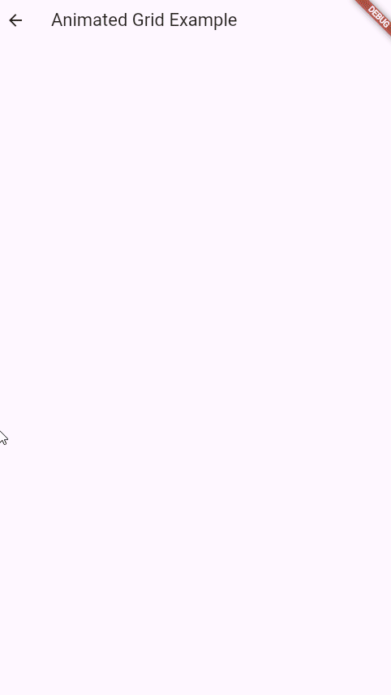

# Flutter Animated Grid Package

[](https://pub.dev/packages/flutter_nude_checker)


The Animated Grid package for Flutter provides a customizable and visually appealing animated grid layout. Easily create grids with items that animate into view with a staggered effect, enhancing the user experience. It supports various widgets including network and asset images, custom design and animation controls, and more.

## Preview

<div align="center">
  
</div>

## Features

- **Staggered Animations:** Items animate into the grid with a staggered delay.
- **Custom Swipe & Drag Callbacks:** Easily handle swipe and drag events.
- **Customizable Design:** Adjust card size, animation durations, rotation angles, and more.
- **Network & Asset Images:** Display images from the internet or local assets.
- **Highly Customizable:** Control animation durations, delays, initial offsets, and appearance (e.g., border radius, shadows).
- **Flexible Layout:** Configure the number of columns, spacing, and item fit.
- **Loading Placeholder:** Customizable placeholder for network images while loading.
- **Material 3 Support:** Designed to work well with the latest Flutter UI.

## Installation

1.  Add the package to your `pubspec.yaml` file:

    ```yaml
    dependencies:
      flutter_animated_grid: ^1.0.0 
    ```

    Then, run `flutter pub get` in your terminal.

## Usage


```dart
AnimatedGridView(
        crossAxisCount: 2,
        spacing: 15,
        staggerDuration: const Duration(milliseconds: 150),
        animationDuration: const Duration(milliseconds: 700),
        initialSlideOffset: 70.0,
        placeholderColor: Colors.grey[300],
        imageFit: BoxFit.fitWidth,
        borderRadius: 20.0,
        shadowColor: Colors.purple,
        shadowBlurRadius: 20.0,
        shadowOffset: const Offset(2, 5),
        children: [
          Image.network(
        'https://picsum.photos/1200/1600?random=1',
        fit: BoxFit.cover,
          ),
          Image.network(
        'https://picsum.photos/1200/1600?random=2',
        fit: BoxFit.cover,
          ),
          Image.network(
        'https://picsum.photos/1200/1600?random=3',
        fit: BoxFit.cover,
          ),
          Image.network(
        'https://picsum.photos/1200/1600?random=4',
        fit: BoxFit.cover,
          ),
          Container(
        color: Colors.red,
        child: const Center(child: Text('Custom Widget')),
          ),
          Container(
        color: Colors.green,
        child: const Center(child: Text('Another Custom Widget')),
          ),
          const Icon(Icons.star, size: 50),
        ],
      ),
```

## Customization

The `AnimatedGrid` widget offers numerous customization options.  See the table below for a complete list:

| Parameter               | Description                                                                                                                            | Default Value                   |
| ----------------------- | --------------------------------------------------------------------------------------------------------------------------------------- | ------------------------------- |
| `children`              | The list of child widgets to display in the grid.                                                                                     | `[]`                           |
| `crossAxisCount`        | The number of columns in the grid.                                                                                                       | `2`                            |
| `spacing`               | The spacing between grid items.                                                                                                        | `16`                           |
| `staggerDuration`       | The duration for the staggered animation delay between items.                                                                             | `Duration(milliseconds: 100)`  |
| `animationDuration`     | The duration for the animation of each grid item.                                                                                         | `Duration(milliseconds: 500)`  |
| `initialSlideOffset`    | The initial vertical offset for the slide animation (how far items slide in).                                                        | `50.0`                         |
| `placeholderColor`      | The color of the placeholder shown while images are loading (used with `CachedNetworkImage`).                                         | `Colors.grey[500]`            |
| `imageFit`              | The `BoxFit` for images (used with `CachedNetworkImage`).                                                                               | `BoxFit.cover`                 |
| `borderRadius`          | The border radius for each grid item.                                                                                                    | `12.0`                         |
| `shadowColor`           | The color of the shadow for each grid item.                                                                                              | `Colors.black`                 |
| `shadowBlurRadius`      | The blur radius of the shadow for each grid item.                                                                                        | `15.0`                         |
| `shadowOffset`          | The offset of the shadow for each grid item.                                                                                             | `Offset(0, 4)`                 |

## Contributing

We welcome contributions! If you have any ideas, bug fixes, or improvements, please open an issue or submit a pull request on our [GitHub repository](https://github.com/xeron56/flutter_animated_grid).

## TODO

- [] Improve performance with larger grids.
- [] Add more animation features.
- [] Add the option to set up different grid alignments

